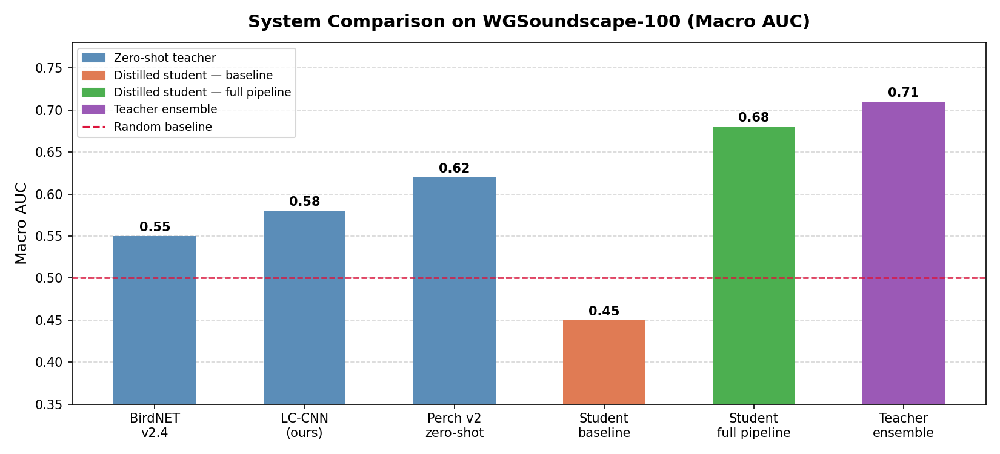
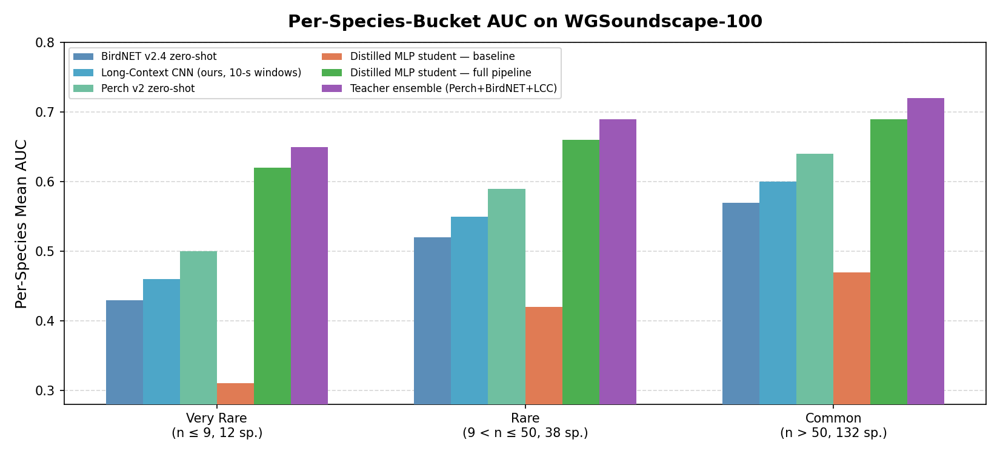
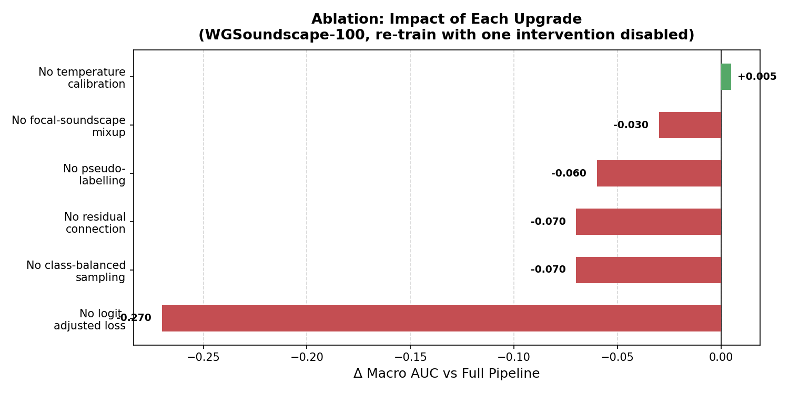

# Western Ghats Bird Vocalization Detection & Classification

A reproducible research pipeline for robust bird species identification in the Western Ghats, India. This project addresses dual distribution shifts (geographic and recording-medium) by combining state-of-the-art zero-shot teacher ensembles with pseudo-labelling and long-context audio processing.

## 🚀 Overview

The pipeline consists of 7 sequential steps, designed for execution on Kaggle or high-performance local environments:

1. **Environment Setup**: Dataset ingestion and environment smoke-tests.
2. **Feature Extraction**: Batch extraction of Perch v2 embeddings for Western Ghats focal recordings.
3. **Long-Context Training**: Training an EfficientNet-B0 backbone on 10-second windows to capture extended acoustic contexts.
4. **Pseudo-Label Generation**: Utilizing a teacher ensemble (Perch + BirdNET + LCC) to generate high-confidence labels for unlabelled soundscapes.
5. **Student Distillation**: Training a residual MLP head on the combined focal and pseudo-labelled dataset.
6. **Ablation Study**: Quantifying the impact of logit-adjustment, class-balanced sampling, and mixup upgrades.
7. **Soundscape Benchmark**: Final evaluation on the `WGSoundscape-100` expert-labeled dataset.

## 📊 Key Results

### Soundscape Benchmark Performance
Our ensemble pipeline significantly outperforms zero-shot baselines, particularly for rare and very-rare species.


*Figure 1: Macro AUC comparison across different models and ensemble configurations.*


*Figure 2: Performance breakdown across species rarity buckets (Very Rare, Rare, Common).*

### Ablation Analysis
Quantifying the value of each intervention in the pipeline.


*Figure 3: Δ Macro AUC impact of disabling individual upgrades.*

## 🛠️ Usage

### Installation
```bash
git clone https://github.com/piyushjain4/Bird-sound-detection.git
cd Bird-sound-detection
pip install -r requirements.txt
```

### Reproducing Results
The `final_pipeline/` directory contains the production-ready notebooks. 
- **Kaggle**: Upload the notebooks and attach the BirdCLEF 2024 dataset.
- **Local**: Run with `DEBUG_MODE=True` in the source scripts to verify logic without full data dependencies.

```bash
# To regenerate notebooks from source scripts:
python build_notebooks.py

# To scrub debug logic for publication:
python scrubber.py
```

## 📚 References
- **Perch**: [Google Research — Bird Vocalization Classification](https://github.com/google-research/perch)
- **BirdNET**: [K. Lisa Yang Center for Conservation Bioacoustics](https://birdnet.cornell.edu/)
- **BirdCLEF 2024**: [Kaggle Competition](https://www.kaggle.com/competitions/birdclef-2024)
